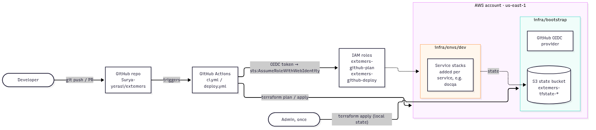

# High-level design: platform

## Purpose

Provide everything a new service needs to go from a pull request to running in AWS safely:

- infrastructure as code
- a reviewed plan on every PR
- automatic deployment after merge
- no stored AWS credentials
- consistent tagging for cost and cleanup

Services (the first is **docqa**) bring their own code and Terraform modules and plug into this.

## Goals

| Goal | How it is met |
|---|---|
| Repeatable infrastructure | Terraform with remote, versioned, locked state; one root per environment |
| Reviewed changes | Every PR gets a `terraform plan` comment, produced by a read-only role |
| Continuous delivery | When CI passes on `main`, the Deploy workflow applies to `dev` |
| No stored AWS keys | GitHub OIDC federation into two narrowly-trusted IAM roles |
| Least privilege for CI | The deploy role can only manage resources whose names start with an allowed prefix |
| Cost visibility and cleanup | `default_tags` on every resource; tag-based audit and cleanup scripts; cost allocation tags |

## System context

Source: [diagrams/01-system-context.mmd](diagrams/01-system-context.mmd)

Two kinds of change reach AWS:

1. **Account plumbing** (`infra/bootstrap`): the Terraform state bucket, the GitHub OIDC provider, and
   the two CI roles. A human admin applies it once, from a laptop, with local state. CI can never
   change its own permissions.
2. **Service stacks** (`infra/envs/<env>`): everything a service needs. Plans run on PRs and applies
   run after merge, both from GitHub Actions through OIDC.

## Components

| Component | Technology | Responsibility |
|---|---|---|
| IaC | Terraform ≥ 1.10, AWS provider 6.x | Declares every AWS resource |
| State | S3 bucket, versioned, with a native lock file | Shared state for CI and humans; rollback via object versions |
| CI/CD | GitHub Actions (`ci.yml`, `deploy.yml`) | fmt/validate, plan on PRs; apply on `main` |
| CI identity | GitHub OIDC + `extemers-github-plan` / `extemers-github-deploy` | Temporary credentials (≤ 1 h), scoped by token subject |
| Tagging | Provider `default_tags` + module `app` tag | Ownership, cost allocation, tag-based cleanup |
| Tooling | Makefile, pre-commit, scripts | One command set for humans and CI; secret scanning |

## Environments

| Layer | Terraform root | State | Applied by |
|---|---|---|---|
| Account bootstrap | `infra/bootstrap` | Local file (it creates the remote bucket) | A human admin |
| `dev` | `infra/envs/dev` | `s3://extemers-tfstate-<account>/…` | GitHub Actions (humans only for break-glass) |

To add `staging` or `prod`:
1. Copy `infra/envs/dev` and change the state key and `env` tag.
2. Add a GitHub environment, plus a matching trust condition on a deploy role.
3. Ideally, use a separate AWS account.

## Security posture

- No static AWS credentials: CI uses OIDC, and people use `aws login` / IAM Identity Center.
- Each CI role trusts exactly one GitHub token subject. Tokens use GitHub's **immutable subject**
  format (numeric owner and repo IDs), so a renamed or re-created repository cannot impersonate this one.
- PR plans can only read. Only jobs in the `dev` GitHub environment can write, and only to resources
  matching `managed_name_prefixes`.
- The state bucket is private, versioned, encrypted, TLS-only and protected from `destroy`.
- Pre-commit runs gitleaks, AWS-credential detection and private-key detection.
