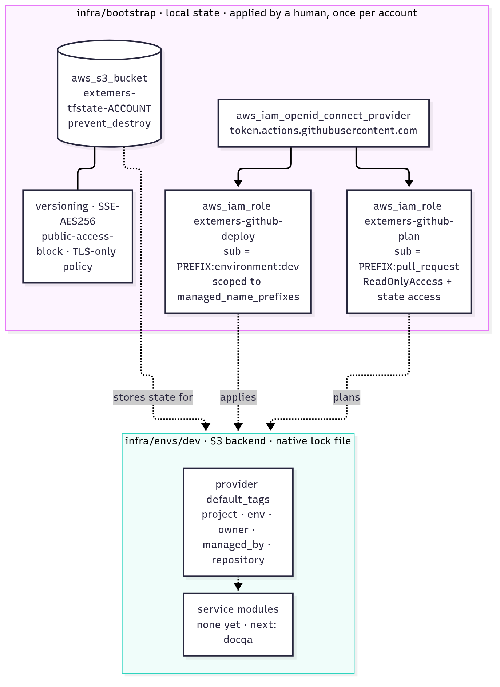

# Low-level design: platform

## Repository layout

```
extemers/
├── infra/
│   ├── bootstrap/        one-time account setup (local state, human-applied)
│   ├── modules/          reusable modules, added per service
│   └── envs/dev/         dev environment root (S3 state)
├── services/             one directory per service, added as built (next: docqa)
├── scripts/              audit_tags.sh, nuke_orphans.sh
├── .github/workflows/    ci.yml, deploy.yml
├── documents/            this documentation
├── Makefile              single entry point for every command
└── .pre-commit-config.yaml
```



<sub>Source: [diagrams/02-infrastructure.mmd](diagrams/02-infrastructure.mmd)</sub>

## `infra/bootstrap`

**Variables**

| Variable | Default | Purpose |
|---|---|---|
| `region` | `us-east-1` | |
| `github_subject_prefix` | `repo:Surya-yerasi@61959369/extemers@1405205156` | Prefix of the OIDC `sub` claim. GitHub's immutable subject format, validated to start with `repo:` |
| `deploy_environment` | `dev` | GitHub environment whose jobs may assume the deploy role |
| `managed_name_prefixes` | `["docqa-"]` | Name prefixes the deploy role may manage |
| `create_oidc_provider` | `true` | Set `false` if the account already has the GitHub provider |

**Resources**

| Resource | Purpose |
|---|---|
| `aws_s3_bucket.state` (`extemers-tfstate-<account>`) | Remote state; `prevent_destroy = true` |
| `…_versioning`, `…_server_side_encryption_configuration`, `…_public_access_block`, `…_policy` | Versioned, AES-256, fully private, denies non-TLS requests |
| `aws_iam_openid_connect_provider.github` | Trusts `token.actions.githubusercontent.com`, audience `sts.amazonaws.com` |
| `aws_iam_role.plan` (`extemers-github-plan`) | Trust: `sub = <prefix>:pull_request`. AWS `ReadOnlyAccess` + state bucket access |
| `aws_iam_role.deploy` (`extemers-github-deploy`) | Trust: `sub = <prefix>:environment:dev`. Permissions below |

**Deploy role permissions** (scoped by `managed_name_prefixes`, currently `["docqa-"]`):

| Statement | Actions | Resources |
|---|---|---|
| State | `s3:ListBucket`, `Get/Put/DeleteObject` | The state bucket |
| `Lambda` | `lambda:*` | `function:docqa-*` |
| `LambdaExecutionRoles` | Create, update, delete and tag roles; inline policies | `role/docqa-*` |
| `PassRoleToLambdaOnly` | `iam:PassRole` with `iam:PassedToService = lambda.amazonaws.com` | `role/docqa-*` |
| `LogGroups` / `LogsAccountLevel` | `logs:*` / describe and list tags | `/aws/lambda/docqa-*` / `*` |
| `EcrRepositories` / `EcrLogin` | `ecr:*` / `ecr:GetAuthorizationToken` | `repository/docqa-*` / `*` (account-level action) |
| `BucketConfiguration` | Create/delete bucket, `GetBucket*`/`PutBucket*`, encryption, lifecycle | `arn:aws:s3:::docqa-*` |
| `DenyDocumentObjects` | **Deny** `Get/Put/DeleteObject*`, `RestoreObject` | `arn:aws:s3:::docqa-*/*`. CI configures the bucket but can never read your documents |
| `UseServiceKms` | `kms:DescribeKey` | The docqa KMS key |
| `Cognito` / `CognitoAccountLevel` | `cognito-idp:*` / create and list pools | `userpool/*` in the region (pool IDs are generated, so they cannot be name-scoped) / `*` |
| `SsmParameters` / `SsmDescribe` | `ssm:*` / `ssm:DescribeParameters` | `parameter/docqa/*` / `*` |
| `Budgets` | `budgets:*` | `budget/docqa-*` |
| `Dashboards` | `cloudwatch:PutDashboard`, `GetDashboard`, `DeleteDashboards` | `dashboard/docqa-*` |
| `Alarms` | `cloudwatch:PutMetricAlarm`, `DeleteAlarms`, `DescribeAlarms`, tag actions | `alarm:docqa-*` in the region |
| `AlarmTopics` | `sns:` create/delete/attributes, subscribe, tag actions | topics named `docqa-*` |
| `AlarmSubscriptions` | `sns:GetSubscriptionAttributes`, `SetSubscriptionAttributes`, `Unsubscribe` | `*` (SNS has no resource-level permissions for these) |

API Gateway and log-delivery permissions were removed with the calculator.

**docqa KMS key** (`kms.tf`, alias `alias/docqa`): rotation on, 30-day deletion window,
`prevent_destroy`. The key policy gives the account root administration, so IAM policies grant use,
and lets CloudWatch Logs encrypt only `/aws/lambda/docqa-*` log groups. It lives in bootstrap so CI
can use it but never schedule its deletion.

**Outputs:** `state_bucket`, `plan_role_arn`, `deploy_role_arn`, `docqa_kms_key_arn`.

## `infra/envs/dev`

| File | Contents |
|---|---|
| `versions.tf` | Terraform ≥ 1.10, AWS provider `~> 6.0`, partial `s3` backend (`key`, `encrypt`, `use_lockfile`), provider `default_tags` |
| `variables.tf` | `region` (`us-east-1`), `owner` |
| `main.tf` | Service module calls. Currently none; removing a module block destroys its resources on the next apply |
| `backend.hcl.example` | Template for the git-ignored `backend.hcl` (bucket, region) |

The backend config is partial so no account ID is committed. CI passes `-backend-config` flags, and
local runs use `backend.hcl`.

## Tags

`default_tags` add `project=extemers`, `env`, `owner`, `managed_by=terraform` and `repository` to every
taggable resource. Each service module sets `app=<service>`. Bootstrap uses only
`app=extemers-bootstrap` and `managed_by`, deliberately without `project`, so tag sweeps never touch
shared plumbing.

## Scripts

| Script | Behaviour |
|---|---|
| `scripts/audit_tags.sh` | Read-only. Lists ARNs tagged `project=<PROJECT_TAG>` (default `extemers`) in `AWS_REGION` via the Resource Groups Tagging API |
| `scripts/nuke_orphans.sh` | Dry run by default. With `--yes` and typed confirmation, deletes tagged Lambda functions, HTTP APIs (stage ARNs mapped back to the API ID) and log groups; lists anything else for manual deletion |

## Makefile targets

| Target | Runs |
|---|---|
| `install` | `pre-commit install` |
| `tf-fmt` / `tf-validate` | `terraform fmt -check`; `init -backend=false` + `validate` for bootstrap, every module and every env |
| `tf-init` / `tf-plan` / `tf-apply` / `tf-destroy` | Against `infra/envs/$(ENV)` (default `dev`) |
| `audit-tags` / `nuke-orphans` | Tag listing / dry-run cleanup |
| `docs-diagrams` | Re-render `documents/diagrams/*.mmd` to PNG |
| `clean` | Remove local build and cache directories |

Service-specific targets (lint, test, build, run) are added with each service.

## Pre-commit hooks

Trailing whitespace, end-of-file, YAML check, large files (> 500 KB), AWS credential detection,
private-key detection, gitleaks, and `terraform fmt`. Each service adds its own language hooks.
