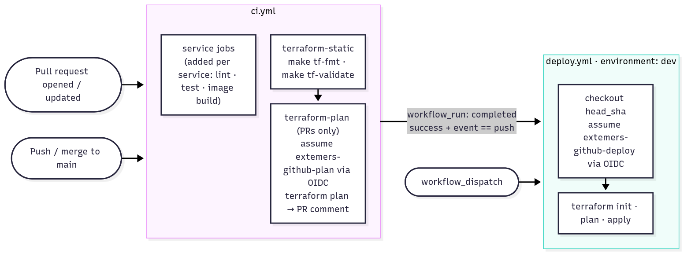
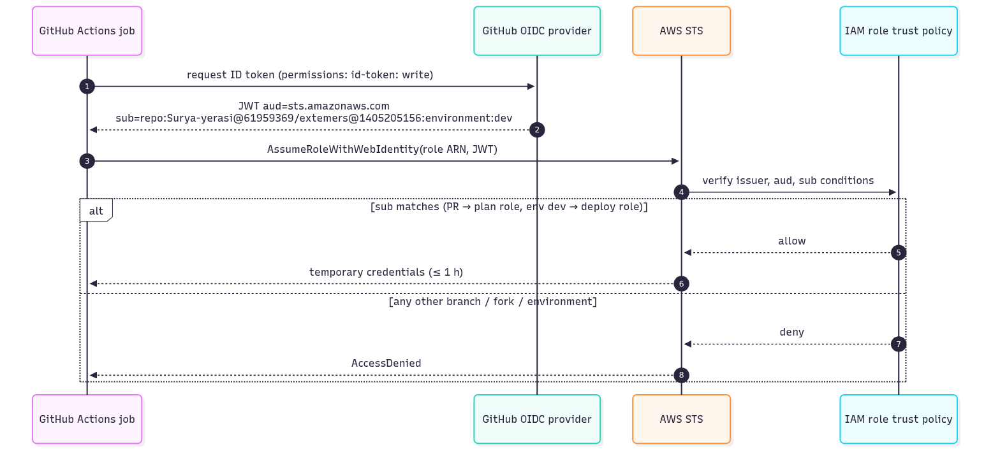

# CI/CD



<sub>Source: [diagrams/03-ci-cd.mmd](diagrams/03-ci-cd.mmd)</sub>

## Overview

| Workflow | File | Triggers | AWS access |
|---|---|---|---|
| CI | [.github/workflows/ci.yml](../.github/workflows/ci.yml) | Every pull request; every push to `main` | Plan role, PR jobs only |
| Deploy | [.github/workflows/deploy.yml](../.github/workflows/deploy.yml) | CI succeeded for a push to `main`; manual run | Deploy role, `dev` environment |

Both default to `permissions: contents: read`. Jobs request `id-token: write` (OIDC) or
`pull-requests: write` (plan comment) only where needed. Terraform is pinned to `1.16.x` in both
workflows, the same version as local development.

## CI workflow (`ci.yml`)

`concurrency: ci-${{ github.ref }}` with `cancel-in-progress: true`: a new push to a PR cancels the
older run.

| Job | When | Steps | Fails when |
|---|---|---|---|
| `terraform-static` | Always | `make tf-fmt`, `make tf-validate` (no AWS credentials) | Unformatted `.tf`; syntax, type or reference errors in bootstrap, any module or any env |
| `terraform-plan` | PRs, after the jobs above, only if `AWS_PLAN_ROLE_ARN` is set; `image_tag` = PR head SHA | Assume `extemers-github-plan` → `init` → `plan -lock=false` → post plan as a PR comment | Plan errors |
| `docqa` | Always | `uv sync --frozen`, ruff, ruff format, mypy strict, pytest (≥ 90% coverage) | Any lint, type or test failure |
| `docqa-image` | Always | arm64 image build via QEMU, GitHub Actions cache, no push | Dockerfile or dependency errors |

**Reading the plan comment:** check that only the expected resources appear, with no surprise
`destroy` or `replace`. For a removal PR, the summary line is the contract, for example
`0 to add, 0 to change, 11 to destroy`.

## Deploy workflow (`deploy.yml`)

```yaml
if: github.event_name == 'workflow_dispatch' ||
    (github.event.workflow_run.conclusion == 'success' && github.event.workflow_run.event == 'push')
```

| Step | Detail |
|---|---|
| Checkout | `ref: workflow_run.head_sha`, the exact commit CI tested |
| Credentials | Assume `extemers-github-deploy`. This only works because the job declares `environment: dev` |
| ECR first | `terraform apply -target=module.docqa_ecr` (no-op after the first run): Lambda needs the image to exist |
| Image | ECR login → arm64 build → push `docqa-dev:<sha>`; skipped if the tag already exists (tags are immutable) |
| Terraform | `init` (S3 backend), `plan -out=tfplan`, `apply tfplan`, with `image_tag = <sha>` |
| Smoke test | `<url>/health` = 200 and `<url>/api/me` without login = 401 |

`concurrency: deploy-dev` with `cancel-in-progress: false` queues deploys instead of cancelling one
mid-apply. Service-specific steps (image push, smoke tests) are added with each service.

**Approvals:** add required reviewers to the `dev` environment (Settings → Environments → dev). The
job then waits for approval before it can get AWS credentials.

## Authentication: GitHub OIDC



| Token `sub` claim | When GitHub issues it | Role it can assume |
|---|---|---|
| `repo:Surya-yerasi@61959369/extemers@1405205156:pull_request` | Any job triggered by a pull request | `extemers-github-plan` (read-only) |
| `repo:Surya-yerasi@61959369/extemers@1405205156:environment:dev` | A job with `environment: dev` | `extemers-github-deploy` |
| Anything else | n/a | None. STS returns `AccessDenied` |

The repository uses GitHub's **immutable subject** format (`use_immutable_subject: true`). The
numeric owner and repo IDs mean a renamed or re-created same-name repository can never match. Check
the format with:

```bash
gh api repos/Surya-yerasi/extemers/actions/oidc/customization/sub
```

It is configured through the bootstrap variable `github_subject_prefix` ([ADR P-07](03-architecture-decisions.md#p-07-immutable-oidc-subject)).

### Required GitHub configuration

| Name | Kind | Scope | Value (bootstrap output) |
|---|---|---|---|
| `dev` | Environment | Repository | Create it; optionally add reviewers |
| `TF_STATE_BUCKET` | Variable | Repository | `state_bucket` |
| `AWS_PLAN_ROLE_ARN` | Variable | Repository | `plan_role_arn` |
| `AWS_DEPLOY_ROLE_ARN` | Variable | Environment `dev` | `deploy_role_arn` |
| `AWS_REGION` | Variable | Repository (optional) | `us-east-1` |
| `ALERT_EMAILS` | Variable | Repository (optional) | JSON list for budget alerts, e.g. `["you@example.com"]` |

## Recommended branch protection for `main`

- Require a pull request before merging.
- Require status checks: **Terraform fmt & validate** and **Terraform plan (dev)**, plus each
  service's jobs.
- Require branches to be up to date. Block force pushes.

## Troubleshooting

| Symptom | Likely cause | Fix |
|---|---|---|
| Jobs "queued", then "not acquired by Runner of type hosted" | GitHub-hosted runner outage | Check githubstatus.com; `gh run rerun <id> --failed` once resolved |
| `terraform-plan` skipped | `AWS_PLAN_ROLE_ARN` not set | Add the repository variable |
| `Not authorized to perform sts:AssumeRoleWithWebIdentity` | Token `sub` doesn't match the trust policy, most often the immutable-subject format or a missing `environment: dev` | Compare `gh api …/oidc/customization/sub` with `aws iam get-role --role-name <role> --query Role.AssumeRolePolicyDocument`; fix `github_subject_prefix` and re-apply bootstrap |
| Deploy never starts | `workflow_run` workflows fire only once the file is on the default branch | Merge first, or run Deploy manually |
| `Error acquiring the state lock` | A crashed apply left the lock | Make sure nothing is running, then `terraform force-unlock <ID>` |
