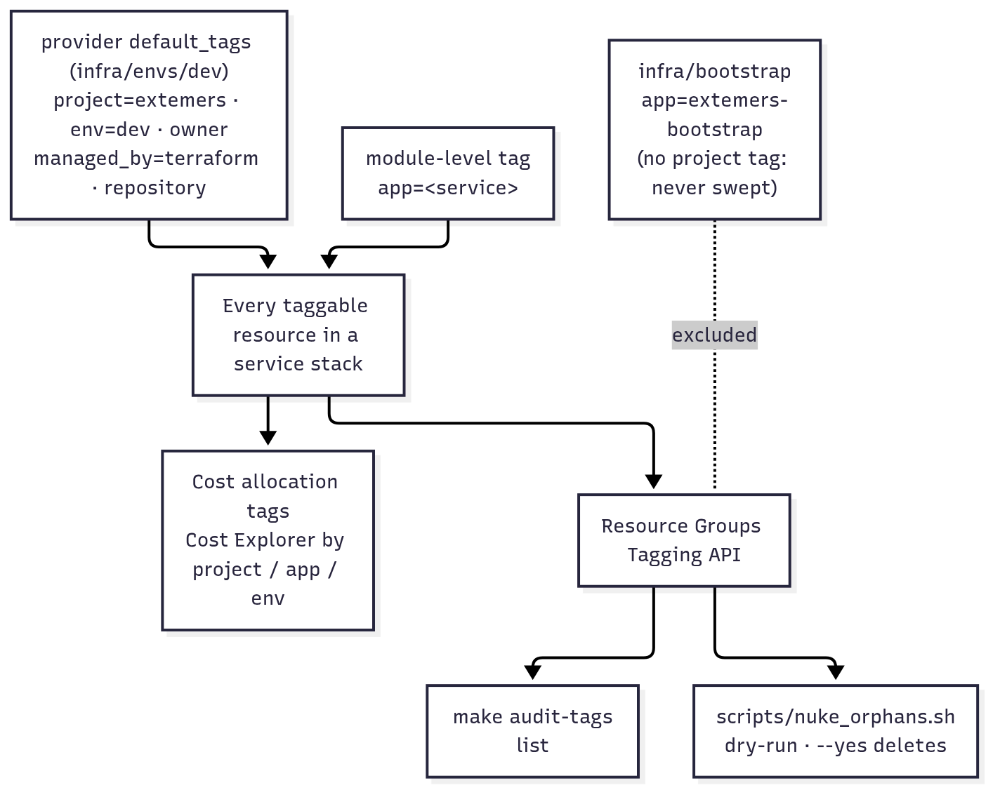

# Operations

## Prerequisites

| Tool | Why | Install |
|---|---|---|
| Terraform 1.16.x | Infrastructure | `brew install hashicorp/tap/terraform` |
| AWS CLI v2 | Credentials, audit scripts | `brew install awscli` |
| GitHub CLI | PRs, CI status, re-runs | `brew install gh` |
| pre-commit | Commit-time checks | `uv tool install pre-commit`, then `make install` |
| Docker | `make docs-diagrams`, service images | Docker Desktop |

## First-time setup (once per AWS account)

1. **Sign in.** `aws login` or `aws sso login`, then `aws sts get-caller-identity`. Use an IAM
   Identity Center admin, **not the root user**.
2. **Bootstrap.**
   ```bash
   cd infra/bootstrap
   terraform init
   terraform plan -out=tfplan     # review
   terraform apply tfplan
   terraform output               # state_bucket, plan_role_arn, deploy_role_arn
   ```
   If the account already has a GitHub OIDC provider, add `-var create_oidc_provider=false`. If
   GitHub's subject format for the repo differs, set `-var github_subject_prefix=…` (see
   [CI/CD](04-ci-cd.md#authentication-github-oidc)).
3. **Keep the bootstrap state safe.** `infra/bootstrap/terraform.tfstate` is git-ignored and exists
   only on the machine that applied it. Back it up, or migrate it into the bucket: add a `backend "s3"`
   block (key `bootstrap/terraform.tfstate`) and run `terraform init -migrate-state`.
4. **Configure GitHub.** Create the `dev` environment and the variables listed in
   [CI/CD](04-ci-cd.md#required-github-configuration).

## Adding a service

1. Add `services/<name>/` (code, tests, Dockerfile) and any modules under `infra/modules/`.
2. Add its `module` blocks to `infra/envs/dev/main.tf`, each tagged `app = "<name>"`.
3. Add its CI jobs (lint, test, build) to `ci.yml`, and any deploy steps (image push, smoke test) to `deploy.yml`.
4. In bootstrap, add `"<name>-"` to `managed_name_prefixes`, extend the deploy-role statements for
   any new AWS services, and re-apply bootstrap yourself (CI cannot).
5. Open a PR. The plan comment should show only the new service's resources.

## Removing a service

1. Delete its `module` blocks from the env root in a PR. The plan must show only that service's
   resources being destroyed ([ADR P-09](03-architecture-decisions.md#p-09-removals-go-through-the-pipeline)).
2. Merge; Deploy applies the destroy.
3. Verify: `make audit-tags` and service-specific listings (`aws lambda list-functions`, etc.).
4. **Only after the destroy** remove the service's prefix from `managed_name_prefixes` and re-apply
   bootstrap. Doing it earlier would leave the deploy role unable to delete the resources.

## Tagging, cost and cleanup



<sub>Source: [diagrams/05-tagging.mmd](diagrams/05-tagging.mmd)</sub>

| Tag | Value | Set by |
|---|---|---|
| `project` | `extemers` | Provider `default_tags` |
| `env` | `dev` | Provider `default_tags` |
| `owner` | `surya` (variable `owner`) | Provider `default_tags` |
| `managed_by` | `terraform` | Provider `default_tags` |
| `repository` | `Surya-yerasi/extemers` | Provider `default_tags` |
| `app` | the service name, e.g. `docqa` | Each service's modules |

Bootstrap resources carry only `app=extemers-bootstrap` and `managed_by=terraform`. They are
excluded from `project` so tag sweeps can never delete the state bucket or CI roles.

**See cost:**
1. In **Billing and Cost Management → Cost allocation tags**, activate `project`, `app` and `env`.
   Do this once; data appears within 24 h.
2. In **Cost Explorer**, group by tag.
3. Add an **AWS Budget** with alerts (planned: $5 actual, $10 forecast).

**See resources:** `make audit-tags`, or a console Resource Group with tag filter `project = extemers`.

**Teardown:**

| Situation | Command |
|---|---|
| Remove one service | PR that deletes its module blocks (see above) |
| Tear down all of `dev` | `make tf-destroy` |
| Terraform state lost or broken | `make nuke-orphans` (dry run), then `./scripts/nuke_orphans.sh --yes` |
| Remove everything, including bootstrap | Destroy every env first. Then drop `prevent_destroy` on the state bucket, empty all object versions, and `terraform destroy` in `infra/bootstrap` |

## Known limitations and next steps

| # | Limitation | Risk | Suggested fix |
|---|---|---|---|
| 1 | Initial setup was done with the AWS **root** user | Root cannot be restricted | Create an IAM Identity Center admin; enable MFA on root and stop using it |
| 2 | Plan role uses AWS-managed `ReadOnlyAccess` | PR plans can read every resource's configuration | Replace it with a policy listing only the services Terraform reads |
| 3 | Plan role can write and delete state objects | A malicious PR workflow could tamper with state | Grant only `s3:GetObject`/`ListBucket` (plans already run `-lock=false`) |
| 4 | Bootstrap state is a local file | If lost, bootstrap must be re-imported | Migrate it to the S3 bucket |
| 5 | One environment in one account | Every change lands in the only environment | Add `envs/prod` in a separate account with required reviewers |
| 6 | Lambda concurrency quota is 10 (new-account default) | No per-function reserved-concurrency cap is possible | Request an increase in Service Quotas (free) if a cap is wanted |

## Incident log

| Date | Event | Impact | Resolution |
|---|---|---|---|
| 2026-10-05 | `make run-local` failed with `Address already in use` | Local only | Stale local server on port 8000; killed it |
| 2026-10-05 | `nuke_orphans.sh` built the wrong API ID from stage ARNs | Would have silently skipped deleting APIs | Fixed the `sed` pattern |
| 2026-10-05 | PR #1 CI jobs stuck "queued", then "not acquired by Runner of type hosted" | CI could not run | GitHub Actions outage; re-ran after resolution |
| 2026-10-05 | `Terraform plan (dev)`: "Not authorized to perform sts:AssumeRoleWithWebIdentity" | No PR plans; deploys would also have failed | Repo uses the immutable OIDC subject format; added `github_subject_prefix` and re-applied bootstrap ([ADR P-07](03-architecture-decisions.md#p-07-immutable-oidc-subject)) |
| 2026-10-06 | First docqa deploy failed at `terraform init`: "Invalid character" in `var.alert_emails` | Nothing created | The variable expected an HCL list but a plain email was entered; it now takes a comma-separated string |
| 2026-10-06 | Second docqa deploy: ECR created and image pushed, then the plan failed: deploy role not authorised for `kms:ListAliases` | Only the ECR repository and lifecycle policy created | Look the key up with `data "aws_kms_key"` (DescribeKey, authorised against the key itself) instead of `aws_kms_alias` (ListAliases on `*`) |
| 2026-10-06 | Bedrock calls throttled: "Too many tokens per day" on a 10-token request | No model calls possible | All on-demand Bedrock quotas applied at 0 (new-account restriction); Service Quotas rejects increases below the default, so a Support case was opened |
| 2026-10-06 | Dev state key renamed `calculator/dev/terraform.tfstate` → `dev/terraform.tfstate` | None (the old state was empty after the removal) | Old object to delete once docqa Phase 1 is applied |
| 2026-10-06 | Calculator service retired | None (by design) | Removed through the pipeline: PR plan `0 to add, 0 to change, 11 to destroy` ([ADR P-09](03-architecture-decisions.md#p-09-removals-go-through-the-pipeline)) |
| 2026-10-06 | Region test for Bedrock: every region throttles or returns "Your account is currently being verified" | No Bedrock in any region | New-account verification, not a regional quota. Escalate to aws-verification@amazon.com; local mode (Ollama) added meanwhile |
| 2026-10-06 | Laptop AWS calls failed with `MissingDependencyException` after `aws login` | `make docqa-dev` / `docqa-ingest` could not reach AWS | The `aws login` credential provider needs `botocore[crt]`; added to docqa's dev dependencies |
| 2026-10-07 | Probe event to `docqa-dev-ingest` for a missing object: 500 with no cause in the logs; 43.9 s duration | Every new-document ingest would have failed, with no explanation in the logs | (1) The policy simulator showed `s3:ListBucket` denied without a prefix, so S3 answered 403 instead of 404; listing is now unconditional for both Lambda roles. (2) Failures are now logged with doc ID and error code. (3) Heavy imports moved out of startup, so the app is ready within Lambda's 10 s init window |
| 2026-10-07 | Pre-merge `simulate-principal-policy` for PR #12: `sns:GetSubscriptionAttributes` / `Unsubscribe` denied on the subscription ARN | The deploy would have failed after creating the topic | SNS authorises subscription actions against `*` only; added a separate `AlarmSubscriptions` statement for those three actions and re-applied bootstrap |
| 2026-10-07 | Agent eval: 2 of 49 questions failed with LanceDB "position is not found but required for phrase queries" | Any quoted search text (agent plan, or a user typing quotes) raised an error under BM25/hybrid | Double quotes are stripped before full-text search; regression test added |
