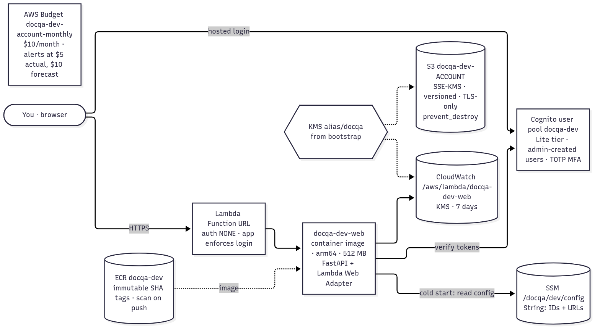
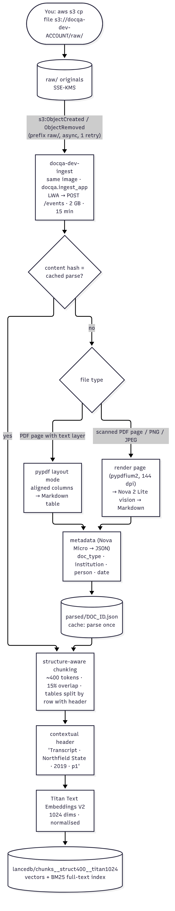
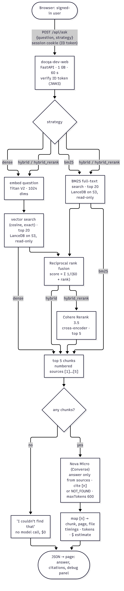
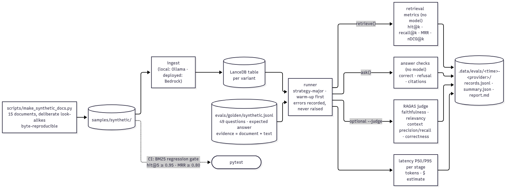
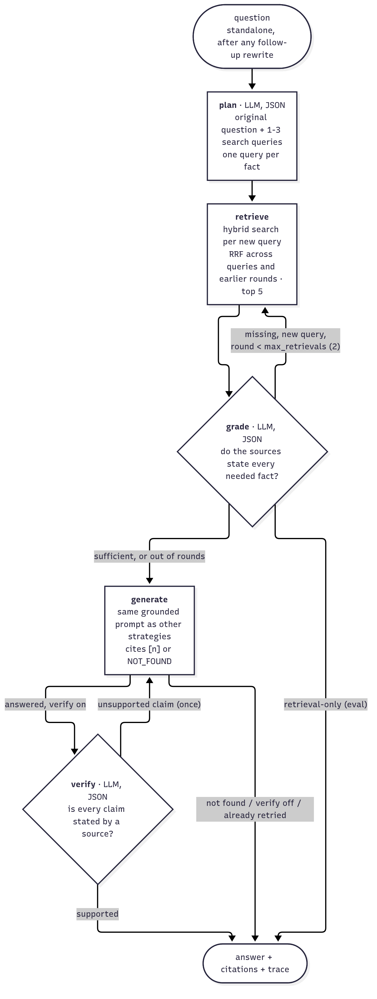
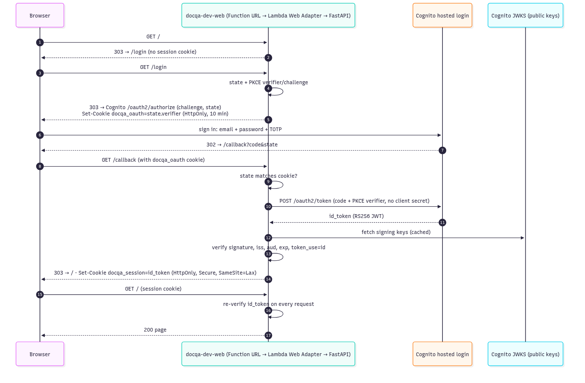

# docqa: personal-document Q&A on Bedrock

docqa answers questions about a small set of personal documents (transcripts, certificates) kept
encrypted in S3. It is also a lab for comparing retrieval designs and evaluating them rigorously.
It is built in phases, and this document grows with each one.

| Phase | Scope | Status |
|---|---|---|
| 1 | Foundations: registry, document bucket, login, web function, image pipeline, budget | Done |
| 2 | Ingestion: parse → chunk → embed → LanceDB on S3 | Deployed (Bedrock calls blocked until the account quota case is resolved) |
| 3 | Ask page with retrieval strategies and citations | Deployed (answers wait for Bedrock access) |
| 3b | Local mode: the same app on free Ollama models, documents kept on the laptop | Done |
| 4 | Evaluation harness (retrieval metrics, RAGAS, latency, cost) | Done |
| 5a | Conversations, follow-up questions, per-question traces (Traces tab), EMF metrics | PR #11 |
| 5b | CloudWatch dashboard, alarms, email alerts | **This PR** (needs a bootstrap update first) |
| 6 | Agent strategy (LangGraph): plan, grade, retry, verify | Done |
| 7 | Metrics tab: live (online) and offline metrics, 👍/👎 feedback, metric guide | **This PR** |

## Phase 1 architecture



<sub>Source: [diagrams/07-docqa-phase1.mmd](diagrams/07-docqa-phase1.mmd)</sub>

| Resource | Name | Notes |
|---|---|---|
| ECR repository | `docqa-dev` | Immutable tags (the git SHA), scan on push, keeps the last 15 images |
| S3 bucket | `docqa-dev-<account>` | SSE-KMS with bucket key, versioned (old versions expire after 30 days), TLS-only, all public access blocked, `prevent_destroy` |
| Lambda function | `docqa-dev-web` | Container image, arm64, 512 MB, 30 s, X-Ray active, JSON logs |
| Function URL | (generated) | Auth type `NONE`; **the app enforces login on every route except `/health`, `/login`, `/callback`, `/logout`** |
| Log group | `/aws/lambda/docqa-dev-web` | Encrypted with the docqa KMS key, 7-day retention |
| Cognito user pool | `docqa-dev` | Lite tier (free), no self sign-up, TOTP MFA required, 12+ character passwords, deletion protection |
| Cognito domain | `docqa-dev-<account>.auth.us-east-1.amazoncognito.com` | Classic hosted login |
| Cognito app client | `docqa-dev-web` | Public client: authorization code + PKCE, **no client secret** |
| SSM parameter | `/docqa/dev/config` | Plain `String`: Cognito domain, client ID, issuer, allowed redirect URIs, bucket name |
| Budget | `docqa-dev-account-monthly` | **Account-wide** $10/month; email at $5 actual and $10 forecast |

All of them carry `app=docqa`, through a provider alias with its own `default_tags`.

## Design decisions

| # | Decision | Why | Rejected |
|---|---|---|---|
| D-01 | **One container image on Lambda, behind a Function URL** | Near-zero cost (Lambda free tier, no hourly resources), HTTPS built in, 15-minute timeout (room for agent loops), and a standard image that can move to AgentCore or ECS unchanged | ECS Fargate + ALB (about $35/month idle), AgentCore Runtime (needs a separate UI host), API Gateway (30 s cap, adds nothing here), CloudFront (not needed) |
| D-02 | **Lambda Web Adapter + FastAPI** | The same uvicorn server runs locally and in Lambda, with no Lambda-specific handler code | Mangum (ASGI shim), Powertools resolver (not a web framework) |
| D-03 | **Cognito hosted login, code + PKCE, public client** | Standard OIDC; the free tier covers it; PKCE means no client secret to store or rotate | Home-made password login; confidential client with a secret in SSM |
| D-04 | **The session cookie is Cognito's ID token, re-verified on every request** | No app signing secret at all; JWKS verification checks signature, issuer, audience, expiry and `token_use` | Server-side sessions (need storage); app-signed cookies (need a secret, and the read-only plan role cannot decrypt SecureString parameters) |
| D-05 | **Config in one SSM `String` parameter, read at cold start** | Breaks the Terraform cycle: Cognito needs the Function URL for its callback, and the function would otherwise need Cognito's IDs in its environment. Plain `String` because nothing in it is secret | Lambda environment variables (cycle); SecureString (the plan role cannot decrypt it) |
| D-06 | **Account-wide budget** | On-demand Bedrock usage is not tagged per app, so a tag-filtered budget would miss the most variable cost | Budget filtered on `app=docqa` |
| D-07 | **ECR created first in Deploy (`-target`)** | Lambda cannot be created before its image exists; a targeted apply of the registry alone is idempotent and runs before the image push | A second Terraform root just for ECR; manual first push |
| D-08 | **No reserved concurrency** | The account's Lambda concurrency quota is 10, and AWS requires at least 10 to stay unreserved, so nothing can be reserved. The quota itself caps concurrency at 10 | Raising the quota (free, via Service Quotas) would allow a per-function cap later |

## Phase 2: ingestion



<sub>Source: [diagrams/08-docqa-ingestion.mmd](diagrams/08-docqa-ingestion.mmd)</sub>

| Stage | Implementation | Notes |
|---|---|---|
| Trigger | S3 notification on `raw/` → `docqa-dev-ingest` (async) | Same image as the web app, different CMD (`docqa.ingest_app`). No Function URL. Failed ingests return 5xx; `AWS_LWA_ERROR_STATUS_CODES=500-599` turns that into a failed invocation, so S3 retries once |
| Identity | `doc_id` = SHA-256 of the object key (16 hex), `content_hash` = SHA-256 of the bytes | Re-uploading to the same key replaces the document; identical bytes reuse the cached parse |
| Text pages | `pypdf` **layout mode**, then `layout_to_markdown` | Default mode emitted one table cell per line (rows lost). Layout mode keeps rows; lines with ≥ 2 wide gaps become a Markdown table |
| Scanned pages and images | Page rendered at 144 dpi (`pypdfium2`) → **Nova 2 Lite** Converse with the image → Markdown | A page counts as scanned when it has fewer than 40 characters of text |
| Metadata | **Nova Micro** returns JSON: `doc_type`, `title`, `institution`, `person`, `date` | Tolerant parsing (code fences, prose, bad JSON → defaults) |
| Parse cache | `parsed/<doc_id>.json` | Chunking/embedding experiments never pay for vision or metadata again |
| Chunking | Headings, paragraphs and tables kept whole; packed to ~400 tokens with ~60 tokens of overlap; oversized tables split by row **with the header repeated**; oversized text split on lines and sentences | Pure function, 13 unit tests |
| Contextual header | `"Transcript · Northfield State University · 2019 · p1"` prepended to `embed_text` only | `text` (shown to users, used by BM25) stays clean |
| Embeddings | **Titan Text Embeddings V2**, 1024 dims, normalised | 256/512 dims are later experiments |
| Index | **LanceDB** table `chunks__struct400__titan1024` at `s3://docqa-dev-<account>/lancedb/` | Vectors and a BM25 full-text index in one table; one table per chunking × embedding variant |
| Deletes | `ObjectRemoved` → remove the document's rows and its parse cache | |

**Ingest IAM (least privilege):** read `raw/*`; read/write/delete `parsed/*` and `lancedb/*`; list only
those prefixes; KMS decrypt/generate only via S3; `bedrock:InvokeModel` on exactly the Nova 2 Lite and
Nova Micro inference profiles (plus their foundation models in any region, as cross-region profiles
require) and Titan V2.

### Phase 2 decisions

| # | Decision | Why | Rejected |
|---|---|---|---|
| D-09 | **Parse once, cache the Markdown in S3** | Vision is the only expensive step; chunking and embedding experiments re-read the cache | Re-parsing per experiment |
| D-10 | **pypdf layout mode → Markdown tables** | Found with the synthetic transcript: default extraction loses table rows, which breaks "what grade did I get in X?" | Default extraction; Textract (costs money; only needed for scans, which already go to vision) |
| D-11 | **Vision only for pages without a text layer** | Digital PDFs are free to parse; vision tokens are spent only on scans and photos | Vision for every page (slower and pricier, risk of transcription errors) |
| D-12 | **One table per index variant** | Experiments (chunk size, embedding dims, contextual on/off) never overwrite each other; the eval harness compares tables | One table, rebuilt per experiment |
| D-13 | **No queue in front of LanceDB writes** | Uploads are rare and Lance commits use S3 conditional writes; a conflict fails the invocation and S3 retries | SQS FIFO for strict serialisation (more parts; S3 cannot target FIFO directly) |
| D-14 | **A synthetic corpus, generated by script** | Tests, CI and future evals never touch real personal documents, and every parsing path (text, table, scan, image) is covered | Testing on real documents |

### Blocker: Bedrock quotas (account verification)

All on-demand Bedrock quotas on this account are applied at **0**, below the AWS defaults (e.g.
8,000,000 tokens/min), and Service Quotas rejects increases. Calling Nova Micro in seven regions
(2026-10-06) showed the cause: every region either throttles or returns *"Your account is
currently being verified"*. Sydney answered once, then returned the same error. So this is
new-account verification, not a per-region quota, and switching regions is not a workaround.

The fix is on AWS's side: the error asks you to write to **aws-verification@amazon.com** if it
lasts more than 2 hours (in addition to the Support case). Until then, ingestion fails at the
first model call. Everything else is tested with fakes, and the whole app runs for real in
[local mode](#local-mode-ollama).

### Runbook: ingestion

| Command | What |
|---|---|
| `make docqa-upload-samples` | Upload the synthetic documents to `raw/samples/`; S3 triggers ingestion |
| `aws s3 cp my.pdf s3://docqa-dev-<account>/raw/` | Add your own document |
| `make docqa-ingest` / `make docqa-ingest KEYS="raw/a.pdf"` | Backfill or re-run from your laptop (prints per-document results) |
| `make docqa-stats` | Chunks in the index |
| `aws logs tail /aws/lambda/docqa-dev-ingest --follow` | Watch ingestion (logs carry IDs and counts, never document text) |

## Phase 3: asking questions



<sub>Source: [diagrams/09-docqa-ask.mmd](diagrams/09-docqa-ask.mmd)</sub>

The page at `/` has a question box, a **retrieval strategy** dropdown and a collapsible **debug
panel**. It calls `POST /api/ask` (login required) and renders the JSON result.

| Strategy | What it does | Model calls per question |
|---|---|---|
| `dense` | Embed the question (Titan V2), exact cosine search, top 5 | embed + generate |
| `bm25` | LanceDB full-text (BM25) search, top 5 | generate only |
| `hybrid` (default) | Dense top 20 + BM25 top 20, fused with **RRF** (k = 60), top 5 | embed + generate |
| `hybrid_rerank` | Hybrid top 20, re-ordered by **Cohere Rerank 3.5**, top 5 | embed + rerank + generate |

**Answer step:** the top 5 chunks become numbered sources `[1]`–`[5]`. Nova Micro answers from
them only, cites `[n]`, or replies `NOT_FOUND`. The app maps each `[n]` back to its chunk, file
and pages; markers outside 1–5 are not treated as citations. If retrieval finds nothing, the
model is not called at all.

**Debug panel**, per question:

| Field | Meaning |
|---|---|
| Timings (ms) | `embed`, `dense_search`, `bm25_search`, `fuse`, `rerank`, `generate`, `total` (measured in the function) |
| Tokens | Generation input/output (from Bedrock); embedding input (estimated as characters ÷ 4) |
| Cost | USD estimate from the price table in `domain/costs.py`; models without a price are listed rather than counted as $0 |
| Chunks | Each chunk's rank and score at every stage (`dense`, `bm25`, `rrf`, `rerank`); cited rows are highlighted |

**Web IAM (least privilege):** read `lancedb/*` only (no `raw/` or `parsed/`), list only that
prefix, KMS decrypt only via S3, and `bedrock:InvokeModel` on Nova Micro (profile + foundation
models), Titan V2 and Cohere Rerank 3.5. The function moves to 1 GB and 60 s.

**Errors:** Bedrock throttling returns 503 "model quota reached"; other AWS errors return 502;
invalid input (empty, over 1,000 characters, unknown strategy) returns 422.

### Phase 3 decisions

| # | Decision | Why | Rejected |
|---|---|---|---|
| D-15 | **Own RRF in `domain/retrieval.py`** | About 20 lines, pure and unit-tested; keeps every stage's rank and score visible for the debug panel and the Phase 4 metrics | LanceDB's built-in hybrid query (hides the per-list ranks; a later comparison) |
| D-16 | **Exact (flat) vector search** | A few thousand chunks: exact search is fast and has perfect recall, so retrieval quality is not confounded by ANN settings | An IVF/HNSW index now (a Phase 4 experiment) |
| D-17 | **Separate read-only searcher** | `LanceChunkSearcher` never creates the table, so the web role needs no write access to the index | Reusing the writer class (would need `PutObject`) |
| D-18 | **Numbered sources + `NOT_FOUND` sentinel** | Citations are checked in code, not trusted; "not found" is a measurable outcome for refusal accuracy in Phase 4 | Free-form citations (file names), JSON output mode |
| D-19 | **Skip the model when retrieval is empty** | No grounding means no answer; saves a call | Letting the model say "not found" |
| D-20 | **`retrieve()` separate from `ask()`** | The eval harness can score retrieval (Recall@k, MRR, nDCG) without paying for generation | One combined call |
| D-21 | **No inline script or style** | The existing CSP (`default-src 'self'`) stays strict; model and document text is only inserted with `textContent` | Relaxing the CSP; a frontend framework |
| D-22 | **QA service built on first question** | `/health` and login never import LanceDB or call Bedrock, so they stay fast and work even if the index is unavailable | Building at startup |

### Runbook: asking

| Command | What |
|---|---|
| Open the Function URL and sign in | The ask page |
| `make docqa-ask Q="What was my GPA?" STRATEGY=hybrid_rerank` | The same pipeline from your laptop; prints the full JSON (answer, chunks, timings, cost) |
| `aws logs tail /aws/lambda/docqa-dev-web --follow` | `ask_completed` log lines: strategy, timings, tokens, cost (never the question or answer) |

Until the Bedrock quota case is resolved and the documents are ingested, expect: `bm25` →
"I couldn't find that in your documents." (no index yet, no model call); `dense`/`hybrid` →
"model quota reached".

## Local mode (Ollama)

The same app on free local models, while Bedrock is unavailable and later for $0 test runs. One
setting, `DOCQA_PROVIDER=local`, swaps the adapters in `pipelines/wiring.py`; the pipelines,
retrieval strategies, prompts, citations and debug panel are unchanged.

| Concern | Deployed (`bedrock`) | Local (`local`) |
|---|---|---|
| Documents, parse cache | S3 `raw/`, `parsed/` | `services/docqa/.data/raw/`, `.data/parsed/` |
| Index | `s3://…/lancedb/chunks__struct400__titan1024` | `.data/lancedb/chunks__struct400__bgem3_1024` |
| Embeddings | Titan Text Embeddings V2, 1024 dims | `bge-m3`, 1024 dims |
| Answers, metadata | Nova Micro | `qwen2.5:7b` |
| Scanned pages | Nova 2 Lite | `qwen2.5vl:7b` |
| Rerank | Cohere Rerank 3.5 | none: `hybrid_rerank` keeps the hybrid order and shows `local/no-rerank` |
| Login | Cognito | Cognito (the deployed pool; `localhost:8080/callback` is allow-listed) |
| Cost | Cents per month | $0 (debug panel shows `local/…` models at $0) |

`.data/` is git-ignored and docker-ignored, so personal documents placed there are never
committed or built into the image.

| Command | What |
|---|---|
| `brew install ollama && brew services start ollama` | Once: install and run Ollama |
| `make docqa-local-models` | Check Ollama and pull missing models (about 12 GB) |
| `make docqa-local-samples` | Copy the synthetic documents into `.data/raw/samples/` |
| `make docqa-local-ingest` | Ingest everything under `.data/raw/` (copy your own PDFs/images there too) |
| `make docqa-local-ask Q="What was the cumulative GPA?" STRATEGY=bm25` | Ask from the terminal (JSON) |
| `make docqa-local-dev` | The web page at http://localhost:8080 with local models |

### Local mode decisions

| # | Decision | Why | Rejected |
|---|---|---|---|
| D-23 | **A provider switch at the composition root** | Proves the ports/adapters split: no pipeline code changes. The same switch later serves free eval runs | A separate local app; mocking Bedrock |
| D-24 | **Separate table name per embedding model** | Titan and bge-m3 vectors are not comparable; a local index can never be mixed into the deployed one (D-12) | One table, rebuilt per provider |
| D-25 | **Local files, not S3, in local mode** | Documents stay on the laptop; the parse cache in S3 is never filled with a different model's transcriptions | Local models reading and writing the S3 bucket |
| D-26 | **`bge-m3` and `qwen2.5` 7B** | bge-m3 gives 1024 dims like Titan and needs no query/document prefixes; qwen2.5 7B follows citation and JSON instructions well and fits in 18 GB of RAM next to the vision model | `nomic-embed-text` (needs task prefixes), `llama3.2:3b` (weaker at citations) |
| D-27 | **No local reranker** | A cross-encoder would add PyTorch to the project (gigabytes); the pass-through is labelled so results are never mistaken for reranked ones | `sentence-transformers` cross-encoder |

## Phase 4: evaluation harness



<sub>Source: [diagrams/10-docqa-evals.mmd](diagrams/10-docqa-evals.mmd)</sub>

One command runs a golden question set through each retrieval strategy and writes a comparison
report. It works the same in local mode (free) and against Bedrock.

### The synthetic corpus and golden set

The corpus is one fictional person's archive of **15 documents**, generated by
`scripts/make_synthetic_docs.py` (byte-reproducible). It includes deliberate **look-alikes**,
so strategies can actually be told apart:
- two transcripts that both list *Machine Learning*, with grades A and B+
- two GPAs (3.86 and 3.72)
- two degree certificates
- two Brightwater letters
- two salaries (offer letter and current)

Two items are image-only (a scanned letter and a card photo), so the vision path is covered too.

`evals/golden/synthetic.jsonl` has **49 questions**:

| Category | Count | Tests |
|---|---|---|
| `fact` | 26 | One fact from one document |
| `table` | 8 | A row in a course table, often with a look-alike in the other transcript |
| `paraphrase` | 5 | Wording that does not appear in the document ("vacation" vs "paid time off") |
| `multi_doc` | 4 | Needs two documents (e.g. salary increase from offer letter to current) |
| `unanswerable` | 6 | Not in the documents; the right answer is "not found" |

Each answerable question lists its **evidence**: the document(s) and a short text that must be
in the retrieved chunk. Matching on text rather than chunk IDs keeps the set valid when chunking
changes. A test checks every evidence text against the generated PDFs, so the corpus and the
golden set cannot drift apart.

A **private golden set** over your real documents uses the same format. Keep it at
`services/docqa/.data/golden/private.jsonl` (git-ignored) and run with
`DATASET=.data/golden/private.jsonl`.

### Metrics

| Group | Metric | Definition |
|---|---|---|
| Retrieval (no model) | hit@k | A relevant chunk is in the top k |
| | recall@k | Share of the evidence items found in the top k (matters for multi-document questions) |
| | MRR | 1 / rank of the first relevant chunk |
| | nDCG@k | Rank-weighted gain; each evidence item counts once |
| Answers (no model) | correct | Answerable: every `must_contain` present, no `must_not_contain`, not refused. Unanswerable: refused |
| | refusal_accuracy / false_refusal_rate | Unanswerable questions refused / answerable questions wrongly refused |
| | citation_hit / citation_precision | At least one citation points to an evidence document / share of citations that do |
| LLM judge (optional) | RAGAS faithfulness, answer relevancy, context precision, context recall, answer correctness | Scored by a judge model through an OpenAI-compatible API (locally: Ollama) |
| Performance | latency P50/P95 | Retrieval stages and end to end, nearest-rank percentiles, after one untimed warm-up per strategy |
| | $ / question | From the price table (`domain/costs.py`); $0 for local models |

`must_contain` matches whole tokens, ignoring commas. Strings of one or two characters are
case-sensitive, so the grade "A" is not matched by the article "a", and "A-" is not "A".

### Baseline (local mode, 2026-10-06)

Local mode means bge-m3 embeddings, qwen2.5:7b answers and 49 questions; `hybrid_rerank` is
excluded locally (see D-31).

| Strategy | hit@1 | hit@5 | MRR | nDCG@5 | correct | refusal acc. | total P50 / P95 ms |
|---|---|---|---|---|---|---|---|
| dense | 0.860 | 0.977 | 0.909 | 0.923 | 0.918 | 1.000 | 2,404 / 3,698 |
| bm25 | 0.814 | 0.977 | 0.882 | 0.908 | 0.939 | 1.000 | 1,719 / 3,365 |
| **hybrid** | **0.860** | **1.000** | **0.924** | **0.945** | **0.959** | 1.000 | 1,962 / 3,684 |

**Findings:**
- **Hybrid is the only strategy that never misses.** Dense and BM25 each fail one paraphrase,
  for opposite reasons:
  - BM25 returns *nothing* for "How much vacation do I get at work?", because no word overlaps
    "paid time off".
  - Dense ranks the Lakeshore documents first for "Which company hired me after my master's?"
- **Look-alikes catch dense retrieval.** For bachelor's-degree grade questions, dense put the
  master's transcript first, and the model answered with the master's grade (table
  correctness 0.62 for dense, vs 0.75–0.88 for the others).
- **The evaluation found a product bug.** The model sometimes refused in prose ("the GPA is not
  provided in the document [1]") instead of `NOT_FOUND`, so the page showed a cited non-answer.
  Tightening the prompt took refusal accuracy from **0.83 to 1.00** for every strategy.
- **Model-side weakness:** every strategy retrieved the right transcript for "Which cloud
  course did I take in Fall 2020?", but qwen2.5:7b still answered "not found". This is a
  generation problem, not a retrieval one; it is worth re-checking with Nova or Claude.
- **Retrieval is cheap; generation dominates.** Retrieval takes 8–40 ms; answers take
  1.7–2.4 s at the median on the laptop.

**Reading the numbers:** with 43 answerable questions, one question is about 2.3 points. Two
local runs differed by one or two questions for the same strategy, so treat smaller differences
as noise.

### Phase 4 decisions

| # | Decision | Why | Rejected |
|---|---|---|---|
| D-28 | **A purpose-built corpus with look-alikes** | With 4 documents every strategy scored 100% (the top 5 held everything); look-alikes make the differences measurable and reflect real archives (two transcripts, two offer letters) | Only the original 4 samples; real documents in CI |
| D-29 | **Evidence by document + text, not chunk ID** | One golden set scores every chunking variant | Chunk IDs (invalid after any chunking change) |
| D-30 | **Deterministic metrics by default; RAGAS judge opt-in** | Deterministic scores are free, fast (6 min locally for 147 answers) and repeatable. The local judge takes about 60 s per answer and grades with the same model family it is grading | Judge on every run |
| D-31 | **Strategy-major order, warm-up call, no `hybrid_rerank` locally** | Item-major order let Ollama reuse its prompt cache when two strategies sent the same prompt (rerank 790 ms vs hybrid 1,920 ms with identical prompts). Locally rerank is a pass-through, so its numbers would only repeat hybrid's | Item-major order; reporting identical strategies twice |
| D-32 | **BM25 regression gate in CI** | Real parsing + chunking + LanceDB full-text, no model calls: a change that hurts retrieval fails the PR | No CI gate (silent regressions); dense gate (CI has no embedding model) |
| D-33 | **RAGAS as a dev-only dependency** | It pulls in LangChain; the Lambda image stays lean. `langchain-community` is pinned to 0.4.1 because 0.4.2 removed a module RAGAS 0.4.3 imports | RAGAS in the runtime image |

### Runbook: evaluating

| Command | What |
|---|---|
| `make docqa-local-eval RETRIEVAL_ONLY=1` | Retrieval metrics only, in seconds |
| `make docqa-local-eval` | Full run, about 6 minutes locally: dense, bm25 and hybrid on 49 questions |
| `make docqa-local-eval STRATEGIES=hybrid LIMIT=10 JUDGE=local` | Add the RAGAS judge (about 1 minute per answer locally) |
| `make docqa-local-eval DATASET=.data/golden/private.jsonl` | Your private golden set |
| `make docqa-eval` | The same against Bedrock and the deployed index (after the quota is lifted; costs cents) |

Results go to `services/docqa/.data/evals/<time>-<provider>/`:
- `report.md`: the comparison tables
- `summary.json`: aggregates
- `records.jsonl`: every question × strategy with the retrieved chunks, answer, scores and timings

**Comparing an index variant**, e.g. smaller chunks: export the variant's settings, then ingest
into its own table and evaluate it.

```bash
export DOCQA_CHUNK_MAX_TOKENS=100 DOCQA_CHUNK_OVERLAP_TOKENS=15 \
       DOCQA_INDEX_TABLE=chunks__struct100__bgem3_1024
make docqa-local-ingest && make docqa-local-eval RETRIEVAL_ONLY=1
```

First experiment (2026-10-06): 100-token chunks made 22 chunks instead of 15 and **hurt**
retrieval. Hybrid hit@5 fell from 1.000 to 0.930 and BM25 from 0.977 to 0.907, because small
chunks separate facts from the heading that says which document (or which transcript) they
belong to. The 400-token default stays.

## Phase 5a: conversations and traces

The page now has two tabs:
- **Chat:** a sidebar of your conversations with *New conversation*, plus a message thread.
- **Traces:** every question's trace, opened by ID or from the link under each answer.

Each view has an address (`#/c/<conversation>`, `#/t/<trace>`), so the browser's back and
forward buttons and bookmarks work.

**IDs.** A conversation is `c_<16 hex>`; question *n* in it is turn `c_<16 hex>.n`. The turn
ID *is* the trace ID. It appears under the answer, in the `turn_completed` log line and on the
`trace_id` property of the CloudWatch metrics, so one ID ties together the page, the logs and
the metrics.

**Follow-up questions.** From the second question on, a `rewrite` step turns the follow-up into
a standalone question using the last 4 exchanges. Only the rewritten question is searched, and
the answer prompt still contains only that question and the retrieved sources, so earlier
answers cannot leak into grounding. The page shows *Searched as: "…"* when the wording changed.
Example (local mode): "And for my master's?" became "What was my cumulative GPA for my master's
degree?" and the answer was 3.72.

**Traces.** Each span records:
- its start offset and duration
- its status (an error span carries the exception)
- attributes: model, tokens, cost, top 5 chunks with scores per retrieval stage, and the rewrite
  input and output

The Traces tab shows them as a timeline; click a step to see its attributes. Also shown: the
chunks given to the model, the raw JSON, and in AWS the X-Ray trace ID and Lambda request ID.
**Failed questions are saved too**, with the failing span, so a throttled Bedrock call or a
stopped Ollama shows *where* it failed. The error response carries `X-Docqa-Trace-Id`.

**Storage.** Conversations are JSON in the same `BlobStore` as the documents:
- S3 when deployed, under `conversations/<hash of user sub>/`, KMS-encrypted like everything else
- `.data/conversations/` in local mode

Each user also has an `index.json`, so the sidebar needs one read. Users only ever see their
own conversations; any other ID returns 404, never 403, so IDs cannot be probed.

| Endpoint | What |
|---|---|
| `POST /api/ask` | `{question, strategy, conversation_id?}` → `{conversation, turn}` (a new conversation when no ID) |
| `GET /api/conversations` | Your conversations, newest first |
| `GET /api/conversations/{id}` | One conversation with all turns and traces |
| `DELETE /api/conversations/{id}` | Delete it |
| `GET /api/traces/{trace_id}` | One turn with its trace |

**Metrics (EMF).** In Lambda, each turn prints one Embedded Metric Format line, which
CloudWatch turns into metrics in namespace `docqa` (dimensions `service`, `environment`):
`AskLatency`, `RetrievalLatency`, `GenerationLatency`, `CostUSD`, `NotFound`, `ModelErrors`.
Six metrics stay inside the 10 free custom metrics. Strategy and trace ID are properties of the
line, not dimensions: they are queryable in Logs Insights and cost nothing extra. Locally,
metrics are switched off.

### Phase 5a decisions

| # | Decision | Why | Rejected |
|---|---|---|---|
| D-34 | **App-level traces stored with the turn** | Work identically locally and in Lambda; viewable in the app by ID; no extra service. The Web Adapter runs the app as a long-lived server, so the X-Ray SDK cannot attach per-request subsegments; the X-Ray trace ID is recorded for correlation instead | X-Ray SDK subsegments; OpenTelemetry collector (more moving parts than this needs) |
| D-35 | **Conversations in the existing bucket via `BlobStore`** | No new service, no deploy-role change, same encryption and access controls as the documents; local mode for free | DynamoDB (the production choice at scale: needs a bootstrap change; a later swap behind the same port) |
| D-36 | **Rewrite follow-ups; ground answers on the standalone question only** | Retrieval needs a self-contained query; keeping history out of the answer prompt keeps answers grounded in sources | Sending the full history to the answer model |
| D-37 | **Turn ID = trace ID = `<conversation>.<n>`** | A trace can be found from its ID alone, with no extra lookup table | Random trace IDs plus an index |
| D-38 | **Save failed turns** | The trace of a failure is the most useful one | Discarding failures (only a log line would remain) |
| D-39 | **EMF metrics with 2 dimensions** | No API calls, no IAM, free-tier; per-strategy detail via Logs Insights | Strategy as a dimension (4× the billed metrics) |
| D-40 | **Unconditional `s3:ListBucket` for both Lambda roles** | A prefix condition does not cover the existence check S3 makes on a missing object, so S3 returned 403 instead of 404. Confirmed with the IAM policy simulator; it would have failed every new-document ingest and every first conversation. Lists names only; contents stay prefix-scoped | Keeping the condition and listing instead of `HeadObject` (third-party code such as LanceDB makes its own existence checks) |
## Phase 5b: dashboard and alarms

All deployed-only: they watch the Lambda functions in AWS, not local mode. Terraform module:
`infra/modules/observability`. The URL is in `terraform output docqa_dashboard_url`.

**Dashboard `docqa-dev`:**

| Widget | Source |
|---|---|
| Web requests, 4xx, 5xx, throttles | `AWS/Lambda` Function URL metrics |
| Time per question P50/P95; retrieval and generation P95 (with the alarm line) | App EMF metrics (`docqa` namespace) |
| Model cost, not-found answers, model errors | App EMF metrics |
| Lambda duration (web P95, ingest max), ingestion events and errors | `AWS/Lambda` |
| Alarm states | The five alarms below |
| Recent questions: trace ID, strategy, total and generation ms, cost, not found, rewritten | Logs Insights over `turn_completed` lines (no question text is logged) |
| Model and provider errors; ingestion results and failures | Logs Insights over `ask_upstream_error`, `ingest_failed`, `document_indexed` |

**Alarms** (email through SNS topic `docqa-dev-alarms` to `ALERT_EMAILS`; each address must
click AWS's confirmation email once):

| Alarm | Fires when | First step |
|---|---|---|
| `docqa-dev-web-5xx` | Any 5xx from the Function URL in 5 minutes (includes quota and provider failures) | Dashboard → *Model and provider errors*; open the trace ID in the app |
| `docqa-dev-web-throttles` | Lambda throttled the web function | Account concurrency is 10: check for a burst |
| `docqa-dev-ingest-errors` | An ingest invocation failed | Dashboard → *Ingestion results and failures* (doc ID, error code) |
| `docqa-dev-model-errors` | A model call failed (throttling, access, timeout) | The `error_code` column; for `ThrottlingException`, check Bedrock quotas |
| `docqa-dev-ask-latency-p95` | P95 time per question > 20 s over 15 minutes | Open a slow trace: which span dominates? |

`treat_missing_data = notBreaching`: no traffic is not an alarm. All of this fits the free
tier: 1 of 3 dashboards, 5 of 10 alarms, SNS email.

**How the pieces connect.** An alarm email names the metric. The dashboard's log tables give
the trace ID for that time. The app's Traces tab shows that question's timeline, with the
failing step and its error. The trace also carries the X-Ray trace ID and Lambda request ID,
for the platform view.

### Phase 5b decisions

| # | Decision | Why | Rejected |
|---|---|---|---|
| D-41 | **Alarm on Function URL `Url5xxCount`, not Lambda `Errors`** | Behind the Web Adapter a 500 is a *successful* invocation, so Lambda `Errors` stays 0 for the web function | Lambda `Errors` (blind to app errors); `AWS_LWA_ERROR_STATUS_CODES` on the web function (would mark user-visible 503s as invocation failures and retry nothing) |
| D-42 | **Alarm ARNs built from names in the dashboard** | The whole dashboard body is known at plan time, so a PR shows exactly what the dashboard will be | Resource attributes (the body shows as "known after apply") |
| D-43 | **SNS topic without a customer-managed key** | Notifications carry alarm names and states only; CloudWatch can publish to a CMK-encrypted topic only after a key-policy change | Encrypting with the docqa key (bootstrap key-policy change for no data benefit) |
| D-44 | **Deploy role scoped to `docqa-*` dashboards, alarms and topics** | Same pattern as every other service: CI can manage only this app's monitoring | `CloudWatchFullAccess` |

## Phase 6: the agent strategy



<sub>Source: [diagrams/11-docqa-agent.mmd](diagrams/11-docqa-agent.mmd). It follows the compiled
graph (`AgentRunner.mermaid()`), with edge labels added.</sub>

`agent` is a fifth retrieval strategy in the dropdown. It runs everywhere the others do: chat,
follow-ups, traces, metrics and the eval harness. Instead of one fixed search, a small LangGraph
state machine decides what to do next:

| Step | What it does | Model call |
|---|---|---|
| **plan** | Keeps the original question and adds 1-3 search queries, one per fact needed (e.g. "salary offer letter", "current salary"), in the documents' own words ("paid time off", not "vacation") | JSON |
| **retrieve** | Hybrid search for each new query; RRF across queries and earlier rounds; top 5 | embeddings only |
| **grade** | "Do these sources state every fact needed?" If not, names the gap and writes a better query; at most one corrective round (`DOCQA_AGENT_MAX_RETRIEVALS=2`). Asked even when nothing was found, because that is when rewording helps most | JSON |
| **generate** | The same grounded prompt as every other strategy: cite `[n]` or `NOT_FOUND` | text |
| **verify** (optional) | "Is every claim stated by a source?" One regeneration with the unsupported claim named. Off by default (no measured gain); `DOCQA_AGENT_VERIFY=true` | JSON |

**Design points:**
- **LangGraph only routes.** Model calls go through the `Generator` port and searches through
  `QAService.retrieve`, so Bedrock/Ollama, cost tracking and tracing are shared with every
  strategy. JSON decisions use Ollama's JSON mode locally. Converse has none, so on Bedrock the
  prompts ask for JSON and the parsers are tolerant.
- **Safe defaults.** A malformed decision falls back to: search the original question; treat
  results as sufficient; treat the answer as supported. A weak model cannot loop, and the
  graph is bounded at 2 search rounds and 1 regeneration (at most 6 model calls).
- **Traced step by step.** Agent steps are top-level spans with their decisions as attributes
  (queries, `sufficient`, `missing`, the retry query, `supported`). Their searches nest one level
  below (`depth`), shown indented in the Traces tab.
- **Lazy.** LangGraph is imported only when the agent strategy is used (0.8 s locally,
  0.25 s in the image). It adds 14 MB to the image (227 → 241 MB).

### Phase 6 results

Local mode (bge-m3 + qwen2.5:7b), 49 golden questions, 2026-10-07. Every agent row ran
after the quote fix (see below):

| Strategy | hit@1 | MRR | Correct | Table lookups | Total P50 / P95 |
|---|---|---|---|---|---|
| hybrid (Phase 3 default) | 0.860 | 0.924 | 0.959 | 0.75 | 2.6 s / 3.8 s |
| agent: plan + one search round (+ verify) | 0.907 | 0.950 | 0.959 | 0.75 | 4.9 s / 8.4 s |
| **agent: plan + corrective round** (default) | **0.930** | **0.957** | **0.980** | **0.88** | **4.0 s / 7.4 s** |
| agent: plan + corrective round + verify | 0.930 | 0.957 | 0.980 | 0.88 | 4.7 s / 9.2 s |

**What the ablation shows:**
- **Planning improves ranking.** The right passage is ranked first more often (hit@1 0.86 → 0.91),
  but on its own it does not change the answers.
- **The corrective round is what turns better retrieval into better answers.** Table
  lookups went from 0.75 to 0.88. These are the look-alike transcript questions, where the
  grader noticed the wrong transcript and searched again.
- **Verify added time and changed no answer** on this set, so it is off by default
  (`DOCQA_AGENT_VERIFY=true` turns it on). It may matter with a different model, or with
  questions that tempt the model to add facts.
- **The cost is time:** 1.5-2× the latency of hybrid locally (3-5 model calls instead of 1).
  On Bedrock with Nova Micro that is about 3-4 extra calls of a few hundred tokens each
  (fractions of a cent).

**Reading it honestly:** on answers, the agent beats hybrid by **one question** (48 vs 47 of
49), within the noise limit set in Phase 4. On retrieval it is 3 questions better at rank 1
(of 43). It is a real but modest gain on an easy, 15-document corpus. A larger private
golden set over your real documents is the way to decide whether it should become the
default. Until then the default stays **hybrid**: faster, nearly as good.

**Bug found by the agent's eval:** the planner sometimes quotes a title
(`"Predicting River Flooding"`). LanceDB parses quotes as a phrase query, which needs word
positions the BM25 index does not store, so it raised an error. Any user typing quotes with
BM25 or hybrid would have hit the same error. Quotes are now stripped before full-text search
(the words are still matched), with a regression test.

### Phase 6 decisions

| # | Decision | Why | Rejected |
|---|---|---|---|
| D-45 | **LangGraph for control flow only; our ports for model calls** | The graph stays readable and testable (a scripted fake model drives every branch), and providers, costs and traces stay uniform across strategies | LangChain chat-model wrappers inside the graph (a second model abstraction, untraced); a hand-written loop (works, but LangGraph is the target for later multi-agent work and exports its own diagram) |
| D-46 | **The agent is a strategy, not a separate endpoint** | The chat, follow-ups, traces, metrics and the eval harness all apply unchanged, so the comparison with the fixed strategies is like for like | A separate `/api/agent` |
| D-47 | **The original question is always the first query** | The plan can only add to the baseline search, never replace it with a worse one | Planned queries only |
| D-48 | **Bounded loops with safe fallbacks** | Predictable cost and latency (at most 2 rounds, 1 regeneration, 6 calls); bad JSON never loops | Unbounded "until sufficient" |
| D-49 | **Grade even with no results; empty results are never sufficient** | Found by the tests: skipping the model there meant no corrective query exactly when it was most needed | Short-circuiting to "not found" |
| D-50 | **Agent settings are environment switches** | `DOCQA_AGENT_VERIFY` and `DOCQA_AGENT_MAX_RETRIEVALS` make ablations a one-line eval run | Code changes per experiment |
| D-51 | **Verify off by default; hybrid stays the page default** | Measured: verify changed no answer and added 0.7 s at P50; the agent's answer gain over hybrid (1 question in 49) is within noise | Shipping every step because it sounds rigorous; making the slower agent the default before a larger eval |

**Run it:** pick *Agent* in the dropdown, or `make docqa-local-eval STRATEGIES=hybrid,agent`
(about 8 minutes locally). For the ablations:
`DOCQA_AGENT_VERIFY=true make docqa-local-eval STRATEGIES=agent` and
`DOCQA_AGENT_MAX_RETRIEVALS=1 make docqa-local-eval STRATEGIES=agent`.

## Phase 7: the Metrics tab

A third tab, **Metrics**, built from data the app already keeps. The concepts are in
[07-ai-metrics.md](07-ai-metrics.md).

| View | Source | Shows |
|---|---|---|
| **Live traffic** | Your stored turns and traces (`GET /api/metrics/live?window=24h\|7d\|30d\|all&strategy=`) | KPI tiles (questions, answer/abstention/error rate, 👍 rate, P50/P95/P99, $/question); time per step (P50 bar, P95 tick, nested agent steps); questions and P95 per day; retrieval signals (top-1 similarity, margin, sources, empty retrieval, rewrites, agent retries); generation and inference (tokens, context size, tok/s, model calls, citations); a per-strategy table |
| **Offline evaluation** | Eval runs under `evals/` (`GET /api/metrics/evals[/{run}]`) | Retrieval (hit@1/5, recall, **precision@5** (new), MRR, nDCG), answer quality, the LLM judge, latency/cost, by category, and a metric across runs |
| **Metric guide** | `GET /api/metrics/glossary` | Every metric's definition, formula, why it matters and its caveat; the same text as the ⓘ next to each number |

**👍/👎 feedback** under each answer (`PUT /api/traces/{id}/feedback`) is stored on the turn,
so every rating links to its trace.

### Phase 7 decisions

| # | Decision | Why | Rejected |
|---|---|---|---|
| D-52 | **In-app dashboard, computed from traces** | Works locally (where the app is used today) and deployed; every number drills down to its questions; new metrics apply to all history | CloudWatch only (deployed-only, no drill-down); counters at write time (cannot add metrics retroactively) |
| D-53 | **Online and offline kept visibly apart** | Behaviour without an answer key is not quality; mixing them invites wrong conclusions | One merged scorecard |
| D-54 | **Glossary in code, served to the UI; a test requires an entry for every shown metric** | The explanation can never drift from, or go missing for, the computation | Hand-written help text in the page |
| D-55 | **Chart forms by job; strategy colours fixed and validated** | Stat tiles for single numbers, bars for magnitude, separate charts for different units, tables with inline bars for multi-metric comparisons; the 5 strategy colours pass the colour-blind validator in both themes, with text labels and table views as relief | Pie/donut charts, a dual-axis chart, colour by rank |
| D-56 | **Feedback stored on the turn** | The 👎 → trace → golden question loop needs the rating next to the evidence | A separate feedback table |

Scaling note: live metrics read every conversation on each refresh, which is fine for one
person. At scale, aggregate on write (the EMF metrics already do) and keep traces for drill-down.

## Login flow



<sub>Source: [diagrams/06-docqa-login.mmd](diagrams/06-docqa-login.mmd)</sub>

Protections:
- `state` is checked with a constant-time comparison.
- The PKCE verifier never leaves the browser cookie and the token request.
- Redirect URIs are built from the `Host` header **only if they are on the allow-list**, which
  blocks host-header injection.
- Cookies are `HttpOnly` and `SameSite=Lax`, plus `Secure` over HTTPS.
- Responses carry CSP, `X-Frame-Options: DENY`, `nosniff` and `no-referrer` headers.
- Logs record the user's `sub` (an opaque ID), never the email address.

## Delivery

| Stage | What happens |
|---|---|
| PR | `docqa` job (ruff, mypy strict, pytest ≥ 90% coverage), `docqa-image` job (arm64 build via QEMU, no push), Terraform plan with `image_tag = <PR head SHA>` |
| Merge | Deploy: targeted apply of `module.docqa_ecr` → build and push `docqa-dev:<sha>` (skipped if it already exists) → plan → apply → smoke test (`/health` = 200, `/api/me` without login = 401) |

Images are built with `--provenance=false --sbom=false`, because Lambda rejects image indexes
that carry attestation manifests.

## Runbook

**Create your login** (once, after the first deploy):

```bash
POOL=$(terraform -chdir=infra/envs/dev output -raw docqa_user_pool_id)
aws cognito-idp admin-create-user --user-pool-id "$POOL" \
  --username you@example.com \
  --user-attributes Name=email,Value=you@example.com Name=email_verified,Value=true \
  --desired-delivery-mediums EMAIL
```

Cognito emails you a temporary password. At first sign-in you choose a new password and scan a
QR code with an authenticator app (TOTP).

**Budget alerts:** add a repository variable `ALERT_EMAILS` with one or more addresses,
comma-separated (e.g. `you@example.com`). Until it is set, the budget exists but sends no email.

**Run locally:**

| Command | What |
|---|---|
| `make docqa-check` | ruff, mypy, pytest |
| `make docqa-dev` | uvicorn with auto-reload on :8080, using the deployed `/docqa/dev/config` (log in through the real Cognito; `http://localhost:8080/callback` is allow-listed) |
| `make docqa-run` | The real arm64 image on :8080, with your current AWS credentials exported into the container for the run only |

**Plan or destroy manually:** `make tf-plan IMAGE_TAG=<sha in ECR>`. The bucket (your documents)
and the KMS key are protected by `prevent_destroy`; Cognito has deletion protection.
